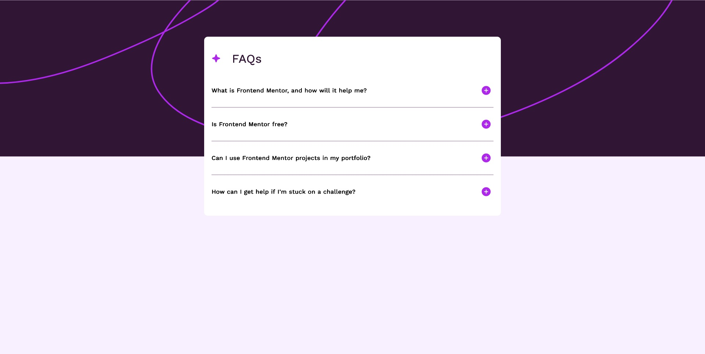
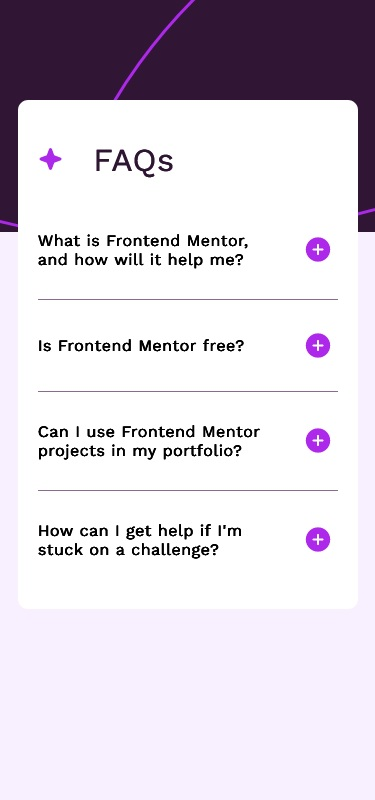

# Frontend Mentor - FAQ accordion solution

This is a solution to the [FAQ accordion challenge on Frontend Mentor](https://www.frontendmentor.io/challenges/faq-accordion-wyfFdeBwBz). Frontend Mentor challenges help you improve your coding skills by building realistic projects. 

## Table of contents

- [Overview](#overview)
  - [The challenge](#the-challenge)
  - [Screenshot](#screenshot)
  - [Links](#links)
- [My process](#my-process)
  - [Built with](#built-with)
  - [What I learned](#what-i-learned)
  - [Continued development](#continued-development)
  - [Useful resources](#useful-resources)
- [Author](#author)

## Overview

### The challenge

Users should be able to:

- Hide/Show the answer to a question when the question is clicked
- Navigate the questions and hide/show answers using keyboard navigation alone
- View the optimal layout for the interface depending on their device's screen size
- See hover and focus states for all interactive elements on the page

### Screenshot Desktop



### Screenshot Mobile



### Links

- Solution URL: [Add solution URL here](https://your-solution-url.com)
- Live Site URL: [Add live site URL here](https://your-live-site-url.com)

## My process

### Built with

- Semantic HTML5 markup
- CSS custom properties
- Flexbox
- CSS Grid
- Mobile-first workflow

### What I learned

First time use of svg images. There are multiple ways to use SVG. Here are two ways I used them in this project.

```html
<object data="./assets/images/icon-star.svg" type="image/svg+xml"></object>
```
```css
body {
  background-image: url("./assets/images/background-pattern-mobile.svg");
}
```

### Continued development

Use this section to outline areas that you want to continue focusing on in future projects. These could be concepts you're still not completely comfortable with or techniques you found useful that you want to refine and perfect.

### Useful resources

- [SelfHTML (german)](https://wiki.selfhtml.org/wiki/SVG/Tutorials/Einstieg/Einbindung) - A good resource in german language for all things HTML, CSS, JavaScript and SVG
- [w3schools](https://www.w3schools.com/howto/howto_js_accordion.asp) - used this "How to" to implement the accordion functionality

## Author

- Frontend Mentor - [@yourusername](https://www.frontendmentor.io/profile/yourusername)